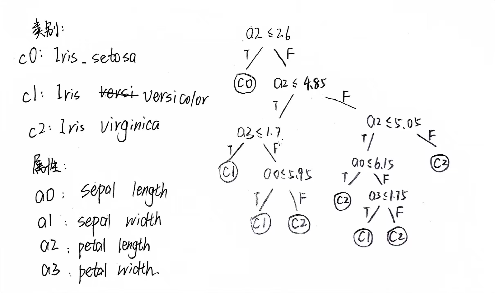

# 3_Decision_Tree_Report

## 任务描述

此次实验使用决策树（Decision Tree）做鸢尾花分类任务。

鸢尾花数据集(Iris Dataset)是机器学习中经典的数据集之一，用于分类和聚类问题。该数据集包含了150个样本，每个样本有四个特征：花萼(sepal)长度、花萼宽度、花瓣(petal)长度和花瓣宽度，同时每个样本都被标记为三个类别之一：Setosa、Versicolour 或 Virginica。

其数据格式类似于：

| sepal_length | sepal_width | petal_length | petal_width | class       |
| ------------ | ----------- | ------------ | ----------- | ----------- |
| 5.1          | 3.5         | 1.4          | 0.2         | Iris-setosa |

## 基础知识

本次实验中的决策树使用 ID3 决策树完成，实现思路参考《机器学习》”西瓜书“，本部分的描述是基于”西瓜书“内容基于我的理解的补充，以及根据代码对知识点的进一步阐述。应当先阅读”西瓜书“对 ID3 决策树有一定的理解之后，再阅读此部分内容。

### 决策树的执行流程

（这里主要是我自己的理解）

根据决策树的思想，在对测试样本进行分类的过程中，我们在上层节点根据某一个属性的取值确定当前需要走的分支，即在根节点向下走的“路线”，而到达某一个叶子节点时，无路可走，也就需要指定当前测试样本的分类结果了，即指定一个类别。

为了进一步理解，首先观察数据集的组织形式，设样本为 $X$，数据集的 label 为 $y$，设共有 $n$ 个样本，每个样本有 $m$ 个属性，每一个样本看作矩阵中的一行， 则：

```shell
X.shape = (n, m)
y.shape = (n, )
```

根据上文，每个节点对应的信息为：

- 上层节点：对应样本某一个维度，即某一个属性的取值情况，根据这个属性的取值，设定分支路线。包含的信息为：确定的样本某个维度、判断条件（包括运算符和阈值）。
- 叶子节点：某一“类别”的信息，即对应样本 label 中的一种取值。

综上，决策树构建完成之后，其进行分类的的执行流程为：输入一个测试样本，自根节点开始，根据当前节点的信息以及自己在这个属性上的取值，确定自己应该走的路线，并最终走到叶子节点时，确定分类结果。

### 决策树的建立流程

我们现在很想知道决策树是如何建立的，尤其是每个节点是如何确定的。

“西瓜书”中的伪代码讲解的较为清晰，其中的重点是“情形 3”的处理过程，这一部分主要对应了决策树上层，首先选择一个“最优属性”，即对应样本的一个维度上的信息，并根据这一个属性的取值进行分类的过程。

对于“情形 3”中最优划分属性的选择，我有一点自己的理解，情形 1、2 参考“西瓜书”或者下文结合代码的详细分析，此处不在赘述。

ID3 决策树基于信息熵（information entropy）的概念进行最优划分节点的选择。“熵”描述的是“混乱程度”，熵越大表示不确定性越大，对于需要进行分类的数据，“信息熵”描述“可用于分类信息的多少”、“能进行分类的可能性的大小”、“样本集合的纯度”。

样本集合信息熵的定义为：
$$
\begin{gathered}
E n t\left(D\right) =- \sum_{k=1}^{\vert y\vert} p_{k}\log_{2}p_{k} \\
\end{gathered}
$$
对于样本集合，我们可以选择一个属性 a 对样本集合 D 进行划分，v ∈ V 表示属性 a 的各个取值。划分之后信息熵减少的量称为“信息增益”，定义如下：

$$
\text{Gain}(D,a)=\text{Ent}(D)-\sum_{v=1}^{V}\frac{|D^v|}{|D|}\text{Ent}(D^v).
$$
我们需要选择信息增益最大的属性进行样本集合 D 进行划分，这既是 ID3 决策树的主要思想。

## 具体实现

本部分根据实验各个方法的分析，描述代码各个部分的原理，最终整合分析

### 依赖

导入 `pandas`、`numpy`、`math` 和 `matplotlib.pyplot` 库以处理数据并绘制决策树。导入 `sklearn.metrics` 和 `sklearn.model_selection` 库以计算准确度并分割数据集。

### 数据导入与处理

从 URL 加载鸢尾花数据集：使用 Pandas 的 `pd.read_csv` 方法从给定的 URL 加载鸢尾花数据集。将列名设置为 'sepal_length'、'sepal_width'、'petal_length'、'petal_width' 和 'class'。然后使用 `drop_duplicates()` 方法删除任何重复行以清理 `iris` 数据帧。

创建 `class_mapping` 字典，其中键是 `iris` 数据帧中唯一的类标签，值是它们对应的整数值。然后使用 `class` 列的 `map` 方法将标签映射到它们的整数值。对应的映射关系为：

```shell
{'Iris-setosa': 0, 'Iris-versicolor': 1, 'Iris-virginica': 2}
```

使用 `sklearn.model_selection` 的 `train_test_split` 方法将数据集分割为训练集和测试集。测试数据大小设置为 20%，随机状态设置为 42 以确保可重现性。

```python
# Load the iris dataset from a local file or online
url = "https://archive.ics.uci.edu/ml/machine-learning-databases/iris/iris.data"
iris = pd.read_csv(url, header=None)
iris.columns = ['sepal_length', 'sepal_width', 'petal_length', 'petal_width', 'class']
iris = iris.drop_duplicates()

# Convert the class labels to integers
class_mapping = {label: idx for idx, label in enumerate(np.unique(iris['class']))}
# print(class_mapping)
iris['class'] = iris['class'].map(class_mapping)

# Shuffle and split
X = iris.iloc[:, :-1].values
y = iris.iloc[:, -1].values
X_train, X_test, y_train, y_test = train_test_split(X, y, test_size=0.2, random_state=42)
```

### 定义 `Node` 类

`Node` 类表示决策树中的一个节点。它有四个属性：`attribute`、`threshold`、`label`、`left` 和 `right`。`attribute` 表示用于分割节点的特征的索引，`threshold` 表示用于分割节点的阈值，`label` 是叶节点的类标签，`left` 和 `right`是左子节点和右子节点。

其中，`attribute` 使用了上文中赋予每个属性的整数值编号。

```python
# Define the Node class for the decision tree
class Node:
    def __init__(self, attribute=None, threshold=None, label=None):
        self.attribute = attribute
        self.threshold = threshold
        self.label = label
        self.left = None
        self.right = None
```

### 定义 ID3 决策树

ID3 方法定义了决策树决策的过程，是本次实验中最为主要的方法。

函数ID3接收四个参数：

- `X`：一个形状为(n_samples，n_features)的numpy数组，包含数据集的特征。
- `y`：一个形状为(n_samples,)的numpy数组，包含数据集的目标标签。
- `depth`：表示树的当前深度的整数（默认为0）。
- `max_depth`：表示树的最大深度的整数（默认为5）。

函数返回决策树的根节点。

根据“西瓜书”中伪代码对一般性决策树的描述，ID3 决策树的返回结果同样可以划分为三类：

首先，该函数首先检查当前树的深度是否等于最大深度，或者 `y` 中的所有目标标签是否相同。如果这些条件中的任何一个成立，它将创建一个叶子节点，叶子节点是当前所有样本中出现最多的类别（对应已经达到最大深度的情况）或左右样本的类别（对应 `y` 中的所有目标标签是否相同的情况）。

其次，如果以上条件都成立，则计算数据集中的特征数（num_features），即每个样本的维度、每个样本包含的属性数量。然后初始化最佳属性，最佳阈值和最佳信息增益的变量（这些定义见“基础知识”部分）。这些变量将在对每个属性及其可能的阈值进行迭代时更新，以找到最佳拆分。

代码然后对每个特征进行迭代，并对当前特征的每个可能阈值进行迭代分析。对于每个阈值，它将数据分为两个集合：一个包含小于或等于该阈值对应的样本集合，另一个包含大于该阈值对应的样本集合。然后使用 `information_gain()` 方法计算拆分的信息增益，并在此拆分的信息增益大于当前最佳时更新 `best_attribute`、`best_threshold` 和 `best_gain`变量。对于信息增益的计算方式，在下文中对应的方法中介绍。

在评估了所有拆分之后，如果最佳信息增益仍然为 `-math.inf`（表示未找到好的拆分），它将创建一个标签等于y的众数的叶子节点，并返回它。这里对应西瓜书中的“情形 2”，对于西瓜书中的描述，这里应为“属性集为空”或“样本在所有属性上取值相同”，显然在这种情况下，最终计算得到的最佳信息增益仍为 `-math.inf`。

如果根据最大信息增益的方式找到了好的拆分，则创建一个新节点，其 `best_attribute` 和 `best_threshold` 值，并对数据的左子集和右子集递归地调用 ID3 函数（其中左子集包含所有具有小于或等于 `best_threshold` 特征值的样本，右子集包含所有具有大于 `best_threshold` 特征值的样本）。

```python
# Define the ID3 decision tree algorithm
def ID3(X, y, depth=0, max_depth=5):
    if depth == max_depth or len(np.unique(y)) == 1:
        label = np.bincount(y).argmax()
        return Node(label=label)
    
    num_features = X.shape[1]
    best_attribute = None
    best_threshold = None
    best_gain = -math.inf
    
    for i in range(num_features):
        feature_values = np.unique(X[:, i])
        for j in range(1, len(feature_values)):
            threshold = (feature_values[j] + feature_values[j-1]) / 2
            left_idx = np.where(X[:, i] <= threshold)
            right_idx = np.where(X[:, i] > threshold)
            left_y = y[left_idx]
            right_y = y[right_idx]
            if len(left_y) == 0 or len(right_y) == 0:
                continue
            gain = information_gain(y, left_y, right_y)
            if gain > best_gain:
                best_attribute = i
                best_threshold = threshold
                best_gain = gain
                
    if best_gain == -math.inf:
        label = np.bincount(y).argmax()
        return Node(label=label)
    
    node = Node(attribute=best_attribute, threshold=best_threshold)
    left_idx = np.where(X[:, best_attribute] <= best_threshold)
    right_idx = np.where(X[:, best_attribute] > best_threshold)
    left_X, left_y = X[left_idx], y[left_idx]
    right_X, right_y = X[right_idx], y[right_idx]
    node.left = ID3(left_X, left_y, depth+1, max_depth)
    node.right = ID3(right_X, right_y, depth+1, max_depth)
```

### 计算熵和信息增益

在“基础知识”部分，我们详细的介绍了每个节点对应的信息熵的计算，以及选择一个特征进行划分时信息增益的计算方式，此处的代码实现了熵的计算和信息增益的计算方式，信息增益的计算方式交于西瓜书更为浅显易懂，采用了划分前后信息熵的差值进行计算，对应公式如下：

信息熵的计算：
$$
\begin{gathered}
E n t\left(D\right) =- \sum_{k=1}^{\vert y\vert} p_{k}\log_{2}p_{k} \\
\end{gathered}
$$
将 `parent` 划分为 `left` 和 `right` 两部分之后，信息增益的计算:
$$
Gain(parenet,left,right) = Ent(parenet)-[Ent(left)+Ent(right)]
$$
两部分代码即实现了这两个公式。

```python
# Define the entropy and information gain functions
def entropy(y):
    _, counts = np.unique(y, return_counts=True)
    probabilities = counts / len(y)
    entropy = np.sum(probabilities * -np.log2(probabilities))
    return entropy

def information_gain(parent, left, right):
    parent_entropy = entropy(parent)
    left_entropy = entropy(left)
    right_entropy = entropy(right)
    left_weight = len(left) / len(parent)
    right_weight = len(right) / len(parent)
    gain = parent_entropy - left_weight * left_entropy - right_weight * right_entropy
    return gain
```

### 运行分类器并计算准确率

首先，使用 ID3 算法训练决策树，其中 `X_train` 和 `y_train` 是训练集的特征和标签数据，`max_depth=5` 表示限制决策树的深度为 `3`，返回训练好的决策树。

接下来定义了一个名为 `predict` 的函数，该函数接受一个样本数据 `X` 和决策树 `tree` 作为输入，用于预测样本数据的标签。如果当前节点的标签不为空，直接返回该节点的标签；否则根据当前节点的属性和阈值将样本数据分配到左子树或右子树，然后递归地对子树进行预测，最终返回预测的标签。

接下来，使用 `predict` 函数对测试集中的每个样本进行预测，得到一个预测结果的 `numpy`数组 `y_pred`。

最后，使用 `accuracy_score` 函数计算预测结果 `y_pred` 和真实标签 `y_test` 之间的准确率，并输出结果。

```python
# Train the decision tree
tree = ID3(X_train, y_train, max_depth=5)

# Define the predict function
def predict(X, tree):
    if tree.label is not None:
        return tree.label
    if X[tree.attribute] <= tree.threshold:
        return predict(X, tree.left)
    else:
        return predict(X, tree.right)
    
# Make predictions
y_pred = np.array([predict(x, tree) for x in X_test])

# Calculate the accuracy
accuracy = accuracy_score(y_test, y_pred)
print("Accuracy:", accuracy)
```

### 决策树可视化

使用matplotlib绘制决策树。`plot_tree` 函数接受四个参数：

- `tree`: 表示要绘制的决策树的根节点。
- `X`: 表示数据集的特征向量。
- `y`: 表示数据集的标签。
- `spacing`: 表示决策树节点之间的间距。

函数首先检查当前节点是否是叶子节点，如果是，则打印"Predict" 和该节点的标签值，然后返回。如果不是，则打印该节点的属性和阈值，并递归地调用 `plot_tree` 函数，传递左子树和右子树作为新的根节点，并且添加额外的缩进，以便更好地区分不同的节点。最终，当所有节点都被访问后，将打印出整个决策树。

```python
# Plot the decision tree with matplotlib
def plot_tree(tree, X, y, spacing="    "):
    if tree.label is not None:
        print(spacing + "Predict", tree.label)
        return
    # three decimal places
    threshold = round(tree.threshold, 3)
    print(spacing + str(tree.attribute) + " <= " + str(threshold))
    print(spacing + "T->")
    plot_tree(tree.left, X, y, spacing + "  ")
    print(spacing + "F->")
    plot_tree(tree.right, X, y, spacing + "  ")

plot_tree(tree, X, y)
```

## 运行结果

### 准确率

项目最终的运行准确率为：$93.33$ %。

```shell
# 输入命令
$ python decision_tree.py
# 运行结果
Accuracy: 0.9333333333333333
2 <= 2.6
T->
  Predict 0
F->
  2 <= 4.85
  T->
    3 <= 1.7
    T->
      Predict 1
    F->
      0 <= 5.95
      T->
        Predict 1
      F->
        Predict 2
  F->
    2 <= 5.05
    T->
      0 <= 6.15
      T->
        Predict 2
      F->
        3 <= 1.75
        T->
          Predict 1
        F->
          Predict 2
    F->
      Predict 2
```

上述命令行的输出结果较为简陋的展示了决策树的构成，对应的详细结构如下所示：



### 运行结果分析

对于运行正确率的分析，进一步探究数据集的质量。

数据集的说明文件 `iris.names` 中有如下描述：

> The 35th sample should be: 4.9,3.1,1.5,0.2,"Iris-setosa"
>
> where the error is in the fourth feature.
>
> The 38th sample: 4.9,3.6,1.4,0.1,"Iris-setosa"
>
> where the errors are in the second and third features.  

由于数据集本身只有 150 个样本，因此在进行模型分析时，数据集中的这两个错误值得考虑。
